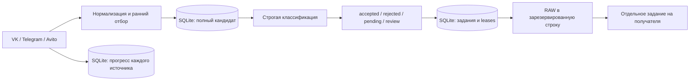

# Парсер заявок на ремонт

Приложение собирает кандидатов из настроенных VK-групп, Telegram-каналов и публичных объявлений Avito, проверяет их через OpenRouter и доставляет принятые заявки в Google Sheets. Уведомления Telegram отправляются после подтверждённой записи в таблицу. Все найденные кандидаты, вердикты, контрольные точки и задания доставки сохраняются в SQLite.

Код организован как модульный монолит: чистое ядро предметной области, прикладные сценарии и отдельные адаптеры API/хранилища. Зависимости направлены к ядру; подключение транспорта не меняет правила квалификации. Подробности и примеры расширения: [архитектура](docs/architecture.md).

Это подготовленная основа версии `0.2.0`, пока с номером `0.2.0.dev0`. Проверки используют синтетические данные. Рабочие аккаунты, качество выбранной модели и доступность текущей вёрстки Avito проверяются отдельно при подготовке клиентского релиза.

## Установка и первый запуск

Поддерживаются CPython 3.12–3.14; для сервера рекомендуется 3.12. Единый источник зависимостей — `pyproject.toml` и `uv.lock`, инструменты разработки находятся в группе `dev`. `requirements.txt` — сгенерированный экспорт runtime с версиями и хешами, вручную его не редактируют. APScheduler и python-dateutil не используются.

```bash
git clone git@github.com:tihonvb/parser.git
cd parser
# Установить uv 0.12.10 по инструкции https://docs.astral.sh/uv/getting-started/installation/
uv sync --locked --python 3.12
cp config.example.yaml config.yaml
cp .env.example .env
chmod 600 config.yaml .env
uv run --locked lead-parser --config config.yaml --check-config
```

`uv sync` устанавливает проект из `src/` в editable-режиме и создаёт консоль `lead-parser`. Эквивалентный запуск — `uv run --locked python -m lead_parser --config config.yaml --check-config`; пакет можно собрать в wheel командой `uv build --wheel`. Для установленного wheel передавайте путь к конфигурации явно. При установке через pip экспорт `requirements.txt` устанавливает только зависимости: после него нужен `pip install --no-deps .` либо установка собранного wheel.

В примере все интеграции выключены: проверка не обращается к API и не создаёт БД. Включите нужные `enabled`, заполните источники и секреты. Для обычного Chromium Avito дополнительно установите браузер: `uv run --locked playwright install chromium`. Для подключённого CDP установка браузера не требуется.

Относительные пути к SQLite, блокировке, Telegram-сессии, VK-токенам и Google-ключу считаются от каталога **выбранного YAML**, независимо от текущего рабочего каталога. Приоритет секретов: переменные процесса → `.env` рядом с YAML → YAML. Действующие имена перечислены в `.env.example`; `VK_TOKEN` поддерживается как alias `VK_ACCESS_TOKEN`. Не включайте секреты в Git и отчёты.

## Настройка интеграций

- **VK static:** `vk.enabled: true`, `token_mode: static`, `VK_ACCESS_TOKEN`, список `group_ids`. Принимаются положительные/отрицательные числа, `club123`, `public123`, короткие имена и ссылки `https://vk.com/...` / `https://vk.ru/...`. Файлы VK ID в этом режиме не нужны.
- **VK ID:** `token_mode: vk_id`, собственный зарегистрированный `client_id` и разрешённый `redirect_uri`. Токен обновляется перед сбором в каждом цикле. YAML не переписывается; значение токена из файла используется в памяти. Права на методы зависят от приложения/профиля; получение токена не гарантирует доступ к `newsfeed.search`/`groups.search`. При необходимости задайте отдельный `VK_SEARCH_TOKEN`.
- **Telegram MTProto:** `TELEGRAM_API_ID`, `TELEGRAM_API_HASH`, список `channels`. Один раз выполните `uv run --locked lead-parser telegram-auth login --config config.yaml` интерактивно. Плановый запуск подключает существующую сессию и не спрашивает телефон или код. Чужие/закрытые каналы могут быть недоступны.
- **Avito:** `city_slug`, `search_queries`; при необходимости существующий `cdp_endpoint` либо управляемый Dolphin с `profile_id`. Парсер читает публичное описание и публичный контакт в тексте. Блокировки и капчи отражаются как ошибки; обход ограничений не реализован.
- **ИИ:** `ai_filter.enabled: true`, `OPENROUTER_API_KEY`, `model`, `min_confidence`. Включённый фильтр без ключа блокирует запуск. Отключение фильтра явно принимает кандидатов без оценки ИИ — для клиентского запуска выбор режима надо зафиксировать.
- **Sheets:** `output.enabled: true`, JSON сервисного аккаунта в `GOOGLE_SERVICE_ACCOUNT_FILE`, `GOOGLE_SPREADSHEET_ID`, `worksheet_name`. Предоставьте адресу сервисного аккаунта доступ редактора. Старый 9-колоночный лист сначала мигрируйте.
- **Telegram Bot API:** `notifications.telegram.enabled: true`, `TELEGRAM_BOT_TOKEN`, `TELEGRAM_CHAT_ID` и/или YAML `chat_ids`. Уведомления требуют включённой доставки Sheets. Список получателей фиксируется при первом создании задания: добавление нового получателя не рассылает старую историю.

Управление VK ID:

```bash
uv run --locked lead-parser vk-auth login --config config.yaml
# Открыть напечатанную ссылку. Полный callback со state действителен 10 минут.
# Чтобы код не остался буквальным значением в истории shell:
read -r VK_CALLBACK
uv run --locked lead-parser vk-auth code "$VK_CALLBACK" --config config.yaml
unset VK_CALLBACK
uv run --locked lead-parser vk-auth refresh --config config.yaml
```

Не публикуйте полный callback. Команда `vk-auth code` принимает **полный callback** с `state`; старые отдельные `code device_id` без проверки state отклоняются. Все команды `vk-auth` используют один менеджер и блокировку; `refresh` не переписывает YAML. Старый сырой JSON без надёжного `expires_at` обновляется один раз; `device_id`, scope и прежний refresh token сохраняются, если сервер не прислал замену. Устаревший PKCE-файл без `created_at` требует нового `login`. Новый формат: `schema_version`, `access_token`, `refresh_token`, `device_id`, `user_id`, `scope`, `expires_at`, `updated_at`. Запись атомарная, права POSIX — 0600. Контракт параметров сверяется с [официальным VK ID SDK](https://github.com/VKCOM/vkid-web-sdk/blob/master/src/auth/auth.ts), обязательный возврат state описан в [OAuth 2.0](https://www.rfc-editor.org/rfc/rfc6749#section-4.1.2).

## Запуск и восстановление

```bash
uv run --locked lead-parser --config config.yaml
uv run --locked lead-parser --config config.yaml --loop
uv run --locked lead-parser --config config.yaml --deliver-only
uv run --locked lead-parser --config config.yaml --status
uv run --locked lead-parser --config config.yaml --backup backups/parser-2026-10-09.sqlite3
uv run --locked lead-parser --config config.yaml --retry-failed
uv run --locked lead-parser --config config.yaml --reclassify 'vk:-123_456'
```

`--deliver-only` обрабатывает сохранённую классификацию и доставку без повторного сбора. Отложенный лид остаётся доступен даже после удаления исходного поста или истечения окна поиска. `--retry-failed` возвращает в очередь исчерпавшие попытки доставки и состояние ИИ `review`; `--reclassify` переоценивает конкретный сохранённый текст. Завершённые задания не отправляются повторно при переоценке.

Коды выхода: **0** — цикл завершён без отставания/ошибок; **1** — неполный сбор, отложенная/неуспешная обработка либо другой сбой; **2** — ошибка конфигурации; **3** — другой процесс держит блокировку. JSON-отчёт содержит состояния лидов/доставки и результаты каждого источника. Причины отсева и счётчики не содержат исходных текстов. `--loop` перечитывает конфигурацию и проверяет VK ID в каждом цикле. Для наблюдаемого планового запуска предпочтителен [systemd timer](deploy/parser.timer); доступны [service](deploy/parser.service) и [cron](deploy/crontab.example). Шаблоны сами ничего не устанавливают; адаптируйте пути, пользователя и разрешения под сервер.

Не запускайте одновременно копии с разными `lock_file`, но одной БД/Telegram-сессией. SQLite и токены защищены дополнительно транзакциями/блокировкой, однако единый процессный lock — эксплуатационный контракт.

## Архитектура и гарантии



Рабочий код находится в `src/lead_parser/`:

| Слой | Ответственность |
| --- | --- |
| `core/` | `Lead`, валидный `Verdict`, явный результат классификации; нормализация, объединение дубликатов и порог принятия |
| `application/` | `PipelineService`, `DeliveryService`, оценка качества и статистика; контракты `Protocol` для источников, классификатора, очереди и доставки |
| `infrastructure/persistence/` | SQLite inbox/outbox, транзакции, сериализация, курсоры, резервирование строки и backup |
| `infrastructure/integrations/` | API VK/Telegram/Avito/OpenRouter/Google Sheets; форматы API и Sheets, OAuth, пагинация, ресурсные ограничения |
| `bootstrap.py` | Сборка конкретных адаптеров и сервисов, конфигурация запуска и процессная блокировка |
| `interfaces/cli/` | Аргументы, вывод и коды завершения; доступ через `lead-parser` и `python -m lead_parser` |

Ядро не импортирует SDK, конфигурацию, SQLite или прикладной слой. Application работает с `Protocol`, не выбирает конкретный API и не выполняет SQL. Класс `Lead` не сериализует себя в БД или строку Sheets: форматы принадлежат адаптерам. Корневые Python-скрипты удалены: все команды доступны через `lead-parser` или `python -m lead_parser`. При обновлении замените команды cron/systemd по [таблице перехода](docs/operations.md#переход-на-единый-cli); библиотечные импорты используют `lead_parser.*`. Примеры и направления зависимостей описаны в [архитектуре](docs/architecture.md).

Дубликаты внутри прогона объединяются по `source:external_id`: порядок первого появления, наиболее полный текст, заполнение отсутствующих метаданных. БД не меняет снимок уже классифицированного лида автоматически. AI требует реальные boolean, уникальные целые индексы, конечную уверенность 0…1 и строковую причину. Транспортная ошибка, конфликт вердиктов или пропущенный индекс оставляют кандидата `pending`, после лимита попыток — `review`. Версия промпта, модель и порог сохраняются вместе с успешным вердиктом.

Строка Sheets резервируется транзакционно **до** отправки HTTP. Повтор пишет в ту же строку A:M с RAW; потеря ответа после записи не создаёт новую строку. Колонка J содержит ключ лида, K — устойчивый ID источника. Конфликт занятой строки останавливает задание. **Не вставляйте/удаляйте строки и не сортируйте физически управляемый лист**: используйте отдельный лист/представления фильтра; заметки можно вести после M. Внешние писатели в A:M не поддерживаются. Полный текст хранится в SQLite; текст более лимита ячейки Sheets сокращается с пометкой.

Telegram Bot API не предоставляет идемпотентный ключ для `sendMessage`: при потере ответа после фактической отправки возможен повтор. Подтверждённые получатели не повторяются; 429 учитывает `retry_after`, постоянные ошибки становятся `failed`. При смене назначения существующие задания остаются привязаны к первоначальному адресу, а новые лиды используют новые настройки; возобновление старых заданий требует вернуть соответствующую конфигурацию. Состояние такой остановленной очереди видно в отчёте.

## Полнота сбора и качество

VK разделяет размер страницы `posts_per_run` (до 100) и бюджет `max_pages_per_query`. Telegram разделяет размер сохраняемой страницы `messages_per_run` и бюджет `max_messages_per_channel`. Первое окно определяется `max_age_hours`/`lookback_hours`; последующие обходы продолжаются до предыдущей контрольной точки. Сохранение страницы предшествует сохранению курсора. При лимите или ошибке остаток остаётся для следующего запуска. Закреплённые старые VK-посты не останавливают обход. Продолжение offset-пагинации проверяет переднюю страницу, поправляет смещение по якорю; при исчезновении якоря повторяет участок от начала, сохраняя исходную границу окна. Удалённые/изменённые API-публикации восстановить невозможно. Следите за `complete: false` и увеличивайте бюджет при длительном отставании.

Глобальный VK-поиск использует `next_from`, однако поисковый индекс не гарантирует охват всех публикаций. Avito сейчас обрабатывает первую страницу выдачи в пределах бюджета деталей; это выборка, не мониторинг всех объявлений. Изменения вёрстки, блокировка и распознанная пустая выдача отличаются в результате. При подключении к чужому CDP закрываются только собственные страницы; созданные ресурсы очищаются независимо, сбой очистки не стирает собранные данные.

Ранний отбор нормализует Unicode/пробелы, сопоставляет заданные фразы либо понятное сочетание запроса исполнителя и темы ремонта/отделки. Он пропускает часть рекламы/недвижимости; следующий AI-этап необходим. Он также способен пропустить нетипичную формулировку: на синтетическом наборе проверяется полнота, на рабочих данных нужна отдельная разметка. Бюджет модели задаётся `max_text_chars` на текст: сохраняются начало и конец, сокращение отмечается; полного анализа произвольно длинного текста это не гарантирует.

```bash
# Бесплатная проверка раннего отбора; метрик качества живой модели здесь нет.
uv run --locked lead-parser evaluate --config config.example.yaml --output reports/offline.json
# Явная платная оценка через выбранную модель:
uv run --locked lead-parser evaluate --config config.yaml --online --output reports/model.json
uv run --locked lead-parser stats --config config.yaml --top 10
uv run --locked lead-parser stats --config config.yaml --human-label 'vk:-123_456' --is-client yes
# Явно обновить существующий лист статистики (его ID сохраняется):
uv run --locked lead-parser stats --config config.yaml --write
```

`src/lead_parser/resources/evaluation.jsonl` содержит 30 синтетических примеров с ответом/причиной, включая пробелы, словоформы, рекламу, жильё, чужой город, неоднозначность и длинные концовки. Online-отчёт содержит модель/промпт/порог, confusion matrix, precision/recall, смысловые и технические ошибки отдельно. Если есть технические пропуски, итоговая матрица pipeline не выдаётся как полная. Для другого целевого города подготовьте соответствующий размеченный набор. Рейтинг использует устойчивые ID, хранит кандидатов, accepted/rejected/pending и отдельные человеческие метки; вердикт ИИ не является фактом сделки. Последняя глубина/полнота обхода и доля кандидатов среди просмотренных наблюдений показываются отдельно от суммарной истории, повторные наблюдения на перекрытии учитываются в счётчиках.

Команды `lead-parser discover`, `lead-parser vk-discovery`, `lead-parser telegram-discovery` пишут CSV для ручного отбора и не меняют подписки/конфиг. `lead-parser vk-groups search` ищет по настроенному городу; `lead-parser vk-groups check candidates.txt` оценивает ссылки, страницы и фактическое покрытие `discovery.days`. Неоднозначный город VK требует явного `discovery.city_id`; неизвестная численность сохраняется как неизвестная. `lead-parser extract-vk-groups` читает устойчивые ID из SQLite без сети. Для discovery нужны настроенные авторизованные интеграции; отсутствие доступа не означает отсутствие источников.

## Разработка и обновление

```bash
uv sync --locked --python 3.12
uv run --locked ruff check .
uv run --locked ruff format --check .
uv run --locked pytest -q
uv run --locked lead-parser --config config.example.yaml --check-config
uv run --locked lead-parser evaluate --config config.example.yaml --output reports/offline.json
uv run --locked python scripts/check_secrets.py
```

Архитектурные проверки контролируют направление импортов, прикладные сценарии проверяются с подставными реализациями портов. CI выполняет эти проверки на 3.12/3.13/3.14 без рабочих секретов; тесты блокируют сеть и подменяют внешние транспорты. Изменение зависимостей: обновить `pyproject.toml`, выполнить `uv lock`, затем `uv export --locked --no-dev --no-emit-project --no-header --output-file requirements.txt`. Изменение промпта требует нового `PROMPT_VERSION` и сравнения отчётов на том же наборе/модели.

Переход на пакетную структуру сохраняет схему SQLite **1**, ключи лидов, содержимое очереди и координаты строк Sheets. Миграция данных для этой перестройки не нужна; перед обновлением всё равно сохраните backup.

Автоматическая выкладка на Linux/systemd запускается тегом `vX.Y.Z` после полного CI; версия пакета должна совпадать с тегом, а коммит — входить в `main`. Сервер и доступы задаются в GitHub environment `production`: [настройка CI/CD и выпуск версии](docs/deployment.md). Рабочие данные и секреты хранятся вне каталога релиза.

При ручном обновлении клиентского экземпляра: остановить расписание → сделать SQLite/Sheets backup → проверить миграцию → установить проверенный commit и `uv sync --locked --no-dev` → конфигурация/смоук-проверка на согласованных тестовых получателях → возобновить расписание. Не удаляйте БД для устранения ошибок и не откатывайте код к JSON-дедупликации поверх новой очереди. Подробности: [эксплуатация и миграция](docs/operations.md), [результат по 20 issues и условия релиза](docs/issue-verification.md), [последующие шаги клиентского релиза](docs/release-readiness.md).
