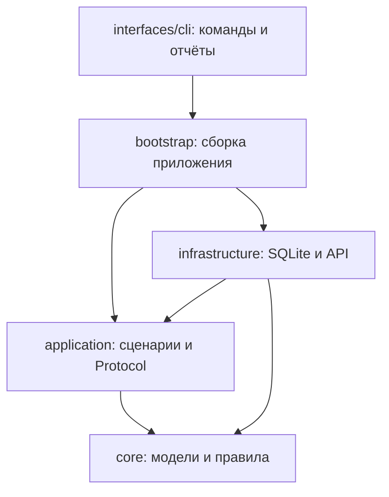

# Архитектура приложения

Приложение — модульный монолит для поиска и квалификации заявок. Мы используем небольшой набор практик DDD и архитектуры портов и адаптеров: язык предметной области, явные бизнес-решения, прикладные сценарии и инверсию зависимостей. Один контекст охватывает путь публикации от кандидата до доставленного лида. Для текущего масштаба отдельные микросервисы, event sourcing, универсальный repository framework и шина событий не нужны.

## Слои и направление зависимостей



Стрелка показывает импорт/зависимость кода, а не движение сообщений. `core` не зависит от внешних слоёв. `application` импортирует ядро и свои контракты; конкретные адаптеры ему неизвестны. `infrastructure` реализует эти контракты, а `bootstrap.py` выбирает реализации и передаёт их сервисам. CLI разбирает команды, загружает настройки и выводит результаты; импорт CLI не запускает сбор или запись.

```text
src/lead_parser/
├── core/
│   ├── models.py            # Lead, Verdict, ClassificationDecision/State
│   └── policies.py          # Нормализация, предфильтр, merge, порог принятия
├── application/
│   ├── models.py            # Результаты сканирования, задания и настройки сценариев
│   ├── ports.py             # Protocol для источников, классификатора и хранения
│   ├── pipeline.py          # Сбор → сохранение → классификация → доставка
│   ├── delivery.py          # План доставки, повторы и подтверждения
│   ├── evaluation.py        # Оценка качества по размеченному набору
│   └── statistics.py        # Показатели источников и человеческая разметка
├── infrastructure/
│   ├── configuration.py    # YAML, .env, проверка и разрешение путей
│   ├── security.py          # Приватные файлы и безопасное отображение ошибок
│   ├── persistence/        # SQLite, JSON-представление модели, backup
│   └── integrations/
│       ├── vk/             # HTTP, OAuth, сбор, discovery и оценка групп
│       ├── telegram/       # MTProto, Bot API, discovery
│       ├── avito/          # Playwright и владение браузерными ресурсами
│       ├── openrouter/     # Промпт, HTTP, проверка ответа и отображение в Verdict
│       └── google_sheets/  # Строки, RAW-запись, миграция и отчётный лист
├── bootstrap.py            # Concrete wiring, процессный lock
├── interfaces/cli/         # Командный интерфейс
└── resources/              # Синтетический evaluation-набор в wheel
```

## Что относится к бизнес-логике

`Lead` хранит идентичность публикации и её содержание. Ключ `source:external_id` не зависит от названия группы. Namespace источника расширяем; интеграция обязана сохранять стабильный внешний ID. Модель не знает о колонках Sheets, JSON или таблицах SQLite.

`Verdict` допускает только настоящий boolean, конечную уверенность от 0 до 1 и текстовую причину. `decide_classification` принимает кандидата, когда вердикт положителен и достигает настроенного порога. `ClassificationDecision` выражает один из результатов: `accepted`, `rejected`, `pending`, `review`. Технический сбой оставляет кандидата в `pending`, исчерпание попыток переводит его в `review`. Явно отключённый классификатор даёт `accepted` без выдуманного вердикта; этот режим необходимо согласовать для рабочего запуска.

Нормализация текста, ранний отбор и объединение повторов находятся в `core/policies.py`. При объединении сохраняется порядок первого появления, наиболее длинный текст и заполненные метаданные. `Lead.extra` пока содержит дополнительный контекст и сохранённые атрибуты модели: это совместимость с существующими данными. Прикладной сценарий принимает решение через `ClassifiedLead.decision`, а не извлекает флаги из словаря провайдера.

`PipelineService` сохраняет страницы до классификации, получает явные результаты от `Classifier`, передаёт их репозиторию и запускает доставку. `DeliveryService` управляет попытками, leases, backoff и подтверждением задания. Он знает `DeliveryPlan` и `DeliveryRoute`, но не знает URL Telegram, номера колонок Sheets или исключения `requests`.

## Контракты

| Порт | Используется для |
| --- | --- |
| `LeadSource.collect(state, reports)` | Сбора кандидатов и отчётов без конкретного класса хранилища |
| `CollectionState` | `ingest`, `cursor`, `checkpoint`; узкий доступ сборщика к сохранению прогресса |
| `Classifier.classify(leads)` | Возвращает `ClassifiedLead` с независимым от API решением |
| `InboxRepository` | Чтения ожидающих кандидатов и сохранения классификации |
| `OutboxRepository` | Сохранения плана, получения задания, подтверждения и переноса попытки |
| `DeliveryGateway.deliver(lead, job)` | Доставки одного лида в одно назначение |
| `RowReservations` | Закрепления строки перед обращением к Sheets |
| `StatisticsRepository` | Чтения представления данных для статистики без SQL в сценарии |

Контракты описаны через `typing.Protocol`; адаптеры могут реализовывать их структурно, без наследования. Сервисы получают зависимости через конструкторы. Конкретные зависимости выбираются в `bootstrap.build_sources`, `build_classifier` и `build_delivery`.

API-адаптер переводит удалённые данные во внутренние модели. Например, OpenRouter проверяет JSON и индексы ответа, создаёт `Verdict`, а порог применяет политика ядра. Sheets создаёт строку через `schema.lead_to_row`, получает её номер через `RowReservations`, затем пишет RAW. Telegram отправляет только одно назначение из задания. Ошибки SDK преобразуются в `DeliveryError` с безопасным сообщением, признаком постоянной ошибки и `retry_after`; прикладному слою не нужно разбирать HTTP.

## Надёжность и совместимость данных


SQLite остаётся конкретным адаптером с прежней схемой **1**. Сохранены таблицы, payload, ID, курсоры, вердикты, назначения и резервирование строк. Перенос кода не требует переноса данных; восстановление очереди после обновления использует существующее состояние. JSON истории старого парсера по-прежнему импортируется отдельно без фиктивных вердиктов. Детали обновления — в [эксплуатации](operations.md).

Важные эксплуатационные ограничения:

- Один сервер, локальная SQLite и единый процессный `FileLock`. Leases и транзакции помогают восстановлению после сбоя, но не превращают конфигурацию в кластер из нескольких хостов.
- Сначала сохраняется страница, затем её контрольная точка. Незавершённое окно продолжается после перезапуска. Удалённую публикацию или неполный поисковый индекс API приложение восстановить не может.
- Sheets резервирует строку до HTTP; потеря ответа повторяет запись в ту же строку. Управляемые строки нельзя физически переставлять или вставлять в их середину. Внешних писателей в A:M быть не должно.
- Telegram имеет семантику at-least-once при неопределённом результате запроса: сообщение могло уйти до потери ответа. Подтверждённые задания не повторяются.
- `ai_confidence` отражает оценку модели, а не человеческую проверку и не факт сделки. Человеческая разметка хранится и показывается отдельно.
- Результаты VK/TG зависят от настроенного окна и доступов; Avito сейчас ограничен первой страницей поисковой выдачи. Смена архитектуры не расширяет эти гарантии.

## Как добавить источник

1. Создать адаптер в `infrastructure/integrations/<provider>/`. Преобразовать ответ API в `Lead` со стабильными `source`/`external_id` и, где доступно, устойчивым `source_group_id`. Ошибки, таймауты и ограничения API остаются внутри адаптера.
2. Реализовать `LeadSource.collect(state, reports)`. Можно использовать существующий `ConfiguredSource` для функции с контрактом `collect_leads(cfg, store=state, reports=reports)` или собственный класс. Сохранять каждую страницу через `CollectionState.ingest` перед `checkpoint`, сохранять продолжение при лимите и сообщать `ScanResult.complete=False` при неполноте.
3. Добавить настройки и их проверку в `infrastructure/configuration.py`, безопасный пример в `config.example.yaml` и регистрацию в `bootstrap.build_sources`. Новая техническая интеграция не требует изменения правил ядра или `PipelineService`.
4. Проверить отображение fixture API в `Lead`, пагинацию, частичный сбой и продолжение после перезапуска. Для сценария использовать подставной `LeadSource` и репозиторий; рабочие аккаунты для unit-тестов не нужны.

Если новый источник приносит другую предметную область или меняет само понятие заявки, правила ядра пересматриваются явно. Расширение транспорта и изменение бизнес-правил — разные задачи.

## Как добавить назначение доставки

1. Реализовать `DeliveryGateway.deliver(lead, job)` в новом адаптере. Считать назначение из `job["destination"]`, преобразовать формат в адаптере, переводить SDK-ошибки в `DeliveryError`.
2. Сформировать назначение в `DeliveryPlan` и маршрут с gateway в `bootstrap.build_delivery`. Текущая модель допускает первичную доставку и зависимые назначения; зависимые задания доступны после подтверждения первичного.
3. Использовать идемпотентный ключ, если целевой API его поддерживает. Иначе определить и документировать поведение при потере ответа; не объявлять гарантию единственной отправки без подтверждения транспортом.
4. Проверить: сбой одного получателя не повторяет успешных, временная ошибка переносит попытку, постоянная останавливает задание, зависимость запрещает преждевременную отправку, завершённое задание не повторяется после переклассификации.

Ядро `Lead` и сценарий `DeliveryService` для нового транспорта менять не требуется. Если для нового назначения нужна дополнительная сохраняемая координата вроде строки Sheets, она принадлежит контракту адаптера/хранилища и требует отдельной оценки миграции.

## Тестирование границ

Тесты ядра используют только внутренние модели и стандартную библиотеку. Для `PipelineService` подставляют источник, классификатор, inbox и runner доставки. Для `DeliveryService` подставляют outbox и gateway. Это позволяет проверять бизнес-результат и повторы без SQLite, SDK и HTTP.

SQLite отдельно проверяется на временном файле: сохранение/перезапуск, конкуренция lease, наследуемая история, резервирование и backup. Интеграции проверяются на сохранённых HTML/JSON и подставных клиентах; сеть в тестах заблокирована. Архитектурные тесты контролируют направление импортов и отсутствие внешних SDK в ядре/сценариях. Smoke-проверка wheel из внешнего рабочего каталога подтверждает, что пакет не зависит от лежащих рядом root-файлов.

```bash
uv sync --locked
uv run --locked ruff check .
uv run --locked ruff format --check .
uv run --locked pytest -q
uv run --locked lead-parser --config config.example.yaml --check-config
uv run --locked lead-parser evaluate --config config.example.yaml --output reports/offline.json
uv build --wheel
```

## Следующий этап

Этап 2 начинается с измерений: объём источников, накопление backlog, скорость квалификации и доставки, доля человечески подтверждённых заявок. Эти данные определяют необходимость общей БД, параллельных workers, административного API, обратной связи заказчика и политик хранения.

Порты позволяют заменить SQLite или классификатор с сохранением прикладных сценариев. Для распределённого исполнения дополнительно потребуется пересмотреть координацию, владение Telegram-сессией, лимиты внешних API и гарантии доставки. Новая структура подготовила эти точки расширения; распределённый режим и клиентский релиз остаются отдельной работой.
